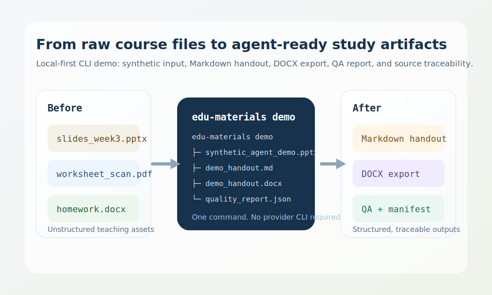

# edu_materials


`edu_materials` is a local-first, source-traceable teaching-material pipeline that AI agents can call through Codex, Claude, or Gemini CLIs.

It turns raw course files such as `PPTX`, scanned `PDF`, and `DOCX` into structured Markdown-first outputs, exportable `DOCX` artifacts, QA reports, and reusable course-library records without bundling vendor SDKs or proprietary skills.



## Why this project exists

- Course materials are messy. Slide decks, scans, and homework files do not arrive in a reusable format.
- Generic LLM wrappers usually hide provenance. This pipeline keeps `source_refs`, manifests, and QA output visible.
- Many education workflows need local preprocessing first and model-backed steps only when necessary.

## Golden Paths

1. `PPTX -> Markdown handout -> DOCX export`
2. `Scanned PDF -> OCR -> sourced handout`
3. `Reference folder -> quiz / assignment analysis / review artifacts`

## 60-Second Quick Start

Requirements:

- Python `>=3.11`

Install:

```bash
python -m venv .venv
# Windows: .\.venv\Scripts\activate
# Linux/macOS: source .venv/bin/activate
python -m pip install --upgrade pip
python -m pip install -e .[dev]
```

After the first PyPI release is published, end users can install it with:

```bash
pip install edu-materials
```

Run the built-in showcase:

```bash
edu-materials demo
```

That single command generates a redistributable synthetic input deck and runs the full handout pipeline into `out/demo/`:

- `out/demo/synthetic_agent_demo.pptx`
- `out/demo/demo_handout.md`
- `out/demo/demo_handout.docx`
- `out/demo/manifest.json`
- `out/demo/quality_report.json`

Check your local runtime before using real files:

```bash
edu-materials doctor
```

Process a real deck:

```bash
edu-materials build-handout --inputs path\to\slides.pptx --output out\slides_handout.docx
```

## What Makes It Different

- Local-first ingestion, OCR orchestration, rendering, caching, and course-library storage.
- Markdown-first outputs with derived export targets such as `docx`, `pdf`, and `html`.
- Visible `manifest.json`, `quality_report.json`, `sections.json`, and `reader_outputs.json`.
- Adapter-backed workflows for Codex, Claude, or Gemini without forcing a vendor SDK into this repo.
- A companion Codex skill wrapper that can be built from source and distributed separately.

## Privacy And External Model Boundary

- Core ingestion, OCR, rendering, export, caching, and course-library indexing run locally.
- Assignment analysis, quiz generation, adapter-backed variant generation, and model-based grading may send content to an external model provider when you pass an adapter command.
- This repository does not bundle proprietary skills or vendor SDKs.
- Do not pass sensitive student data, restricted exam content, or private institutional material to an external adapter unless you are allowed to.

## Platform Matrix

| Platform | Status | Notes |
| --- | --- | --- |
| Windows | First-class | Realistic day-to-day target; optional system tools still need to be installed locally. |
| Ubuntu | Covered in CI | CLI, tests, and demo workflow are exercised in CI. |
| macOS | Best effort | Expect extra local verification for OCR and Office tooling. |

## Optional System Tools

The base Python install is enough for the `demo` workflow and text-first builds. Output quality improves when these are present:

| Tool | Needed for | Required | Why it helps |
| --- | --- | --- | --- |
| `Tesseract` | OCR on scanned PDFs and image-heavy assignments | Required for real OCR workflows | Converts scans into searchable text instead of partial placeholders. |
| `Tesseract` language packs such as `chi_sim` | Chinese or bilingual materials | Recommended | Improves OCR quality for Chinese and mixed-language courseware. |
| `LibreOffice` / `soffice` | PPTX slide rendering and screenshot extraction | Recommended | Produces more complete slide images for figure-heavy decks. |
| `ocrmypdf` | PDF preprocessing before OCR | Optional | Improves OCR stability on noisy scans. |
| `Pandoc` | Downstream publishing/export stacks | Optional | Makes additional conversion pipelines easier later. |
| `Poppler` | External PDF tooling stacks | Optional | Useful in environments that already rely on Poppler utilities. |

If `LibreOffice` is missing, the pipeline still builds text-first handouts and records the gap in QA instead of silently pretending screenshots exist.

## Core Commands

```bash
edu-materials inspect path\to\file.pptx
edu-materials build-handout --inputs path\to\slides.pptx --output out\handout.docx
edu-materials build-assignment-analysis --input path\to\assignment.docx --output out\assignment_analysis.md --adapter-command "python -m edu_materials.adapters.codex_cli_adapter"
edu-materials build-quiz --references-dir path\to\refs --output out\quiz.md --prompt "Generate a short algebra quiz in Chinese." --adapter-command "python -m edu_materials.adapters.codex_cli_adapter"
edu-materials export-question-bank --course-dir path\to\course --output out\question_bank.md
edu-materials grade-submission --course-dir path\to\course --submission path\to\submission.json --output out\grading_report.md
```

The full CLI surface currently includes:

- `demo`
- `inspect`
- `build-handout`
- `qa`
- `build-assignment-analysis`
- `qa-assignment`
- `build-quiz`
- `qa-quiz`
- `index-course-library`
- `query-course-library`
- `export-question-bank`
- `build-mistake-book`
- `refresh-mastery`
- `build-review-pack`
- `build-cram-pack`
- `build-cram-plan`
- `build-rubric`
- `build-variants`
- `grade-submission`
- `export`
- `build-batch`
- `doctor`

## Configuration

The CLI reads configuration from:

- `edu-materials.yaml` or `edu-materials.yml` in the current repo tree
- `~/.edu-materials.yaml`
- `~/.config/edu-materials.yaml`
- `--config <path>`

Start from [edu-materials.example.yaml](edu-materials.example.yaml). The most common first edits are:

- `ocr.language: chi_sim+eng`
- `provider.adapter_command`
- `export.*_targets`
- `quiz.default_language`

## Provider Adapters

The repository includes adapter commands for the three currently supported CLI providers:

- `python -m edu_materials.adapters.gemini_cli_adapter`
- `python -m edu_materials.adapters.claude_code_adapter`
- `python -m edu_materials.adapters.codex_cli_adapter`

They all implement the repo contract of `stdin JSON -> stdout JSON` and can be passed directly to `--adapter-command`.

## Codex Skill Distribution

The companion skill lives in [`skill/`](skill/). The distributable bundle is generated from source; it is not meant to stay committed as a long-lived mainline directory.

Build the bundle:

```bash
python tools/build_skill_bundle.py
```

That creates `skill-dist/edu-materials/` locally. Copy the generated folder into your Codex skills directory, or download the zipped bundle from the release workflow artifact.

Example destination on Windows:

```bash
%USERPROFILE%\.codex\skills\edu-materials\
```

Useful trigger phrases:

- `Use $edu-materials to analyze this assignment and output Markdown.`
- `Use $edu-materials to build a quiz from this references folder.`
- `Use $edu-materials to grade this submission and make a review pack.`
- `用 $edu-materials 解析这份作业并输出 markdown`
- `用 $edu-materials 根据资料目录出一套测验`
- `用 $edu-materials 整理错题本并生成考前复习包`

## Repository Layout

- `src/edu_materials/`: core pipeline, models, readers, renderers, adapters, and QA
- `skill/`: source skill wrapper and helper scripts
- `tests/`: unit and integration coverage based on synthetic fixtures
- `evals/`: fixture policy and human-review rubrics
- `tools/`: maintenance utilities such as license-boundary checks and skill-bundle packaging
- `docs/assets/`: README visuals

## Development, Safety, And Release Hygiene

- Code is licensed under `MIT`.
- Third-party packages and system tools are tracked in [THIRD_PARTY_NOTICES.md](THIRD_PARTY_NOTICES.md).
- Contribution boundaries live in [CONTRIBUTING.md](CONTRIBUTING.md).
- Security reporting guidance lives in [SECURITY.md](SECURITY.md).
- Release steps live in [.github/RELEASE_CHECKLIST.md](.github/RELEASE_CHECKLIST.md).
- PyPI trusted-publishing setup lives in [docs/PYPI_PUBLISHING.md](docs/PYPI_PUBLISHING.md).
- `python tools/check_license_boundary.py` guards against copied proprietary skill material and suspicious fixture naming.

Only commit fixtures that are safe to redistribute. Do not commit proprietary skills, unlicensed courseware, answer keys, student data, grades, or other education records.

## Verification

Minimum local verification before publishing or tagging a release:

```bash
python -m pytest -q
python tools/verify_release_artifacts.py
python -m edu_materials --help
python -m edu_materials doctor
python -m edu_materials demo --output-dir out/demo-smoke
python tools/check_license_boundary.py
```

`python tools/verify_release_artifacts.py` builds both `sdist` and `wheel`, checks packaged prompt templates, runs `twine check`, installs the wheel into an isolated target directory, and reruns CLI smoke checks outside the source tree.

## Known Limitations

- OCR quality depends on local `Tesseract`.
- PPTX slide screenshots depend on local `LibreOffice`.
- Complex formula reconstruction is not implemented.
- No web UI is included.
- `exercise_pack` mode is reserved, not implemented.
- Current tests use self-authored synthetic fixtures rather than full real-world courseware.

## Troubleshooting

- `doctor` reports `tesseract` missing: install Tesseract and ensure it is on `PATH`.
- Chinese OCR quality is weak: install `chi_sim` and set `ocr.language: chi_sim+eng`.
- PPTX builds lack useful screenshots: install `LibreOffice`, expose `soffice` on `PATH`, then rerun `edu-materials doctor`.
- Adapter-backed workflows fail immediately: set `--adapter-command` or configure `provider.adapter_command`.
- Output conversion is weaker than expected: keep Markdown as the canonical output and add `Pandoc` for richer downstream publishing.
